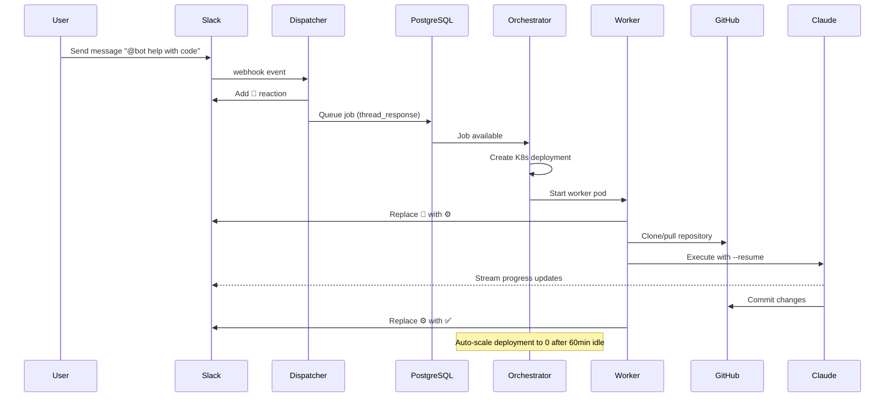
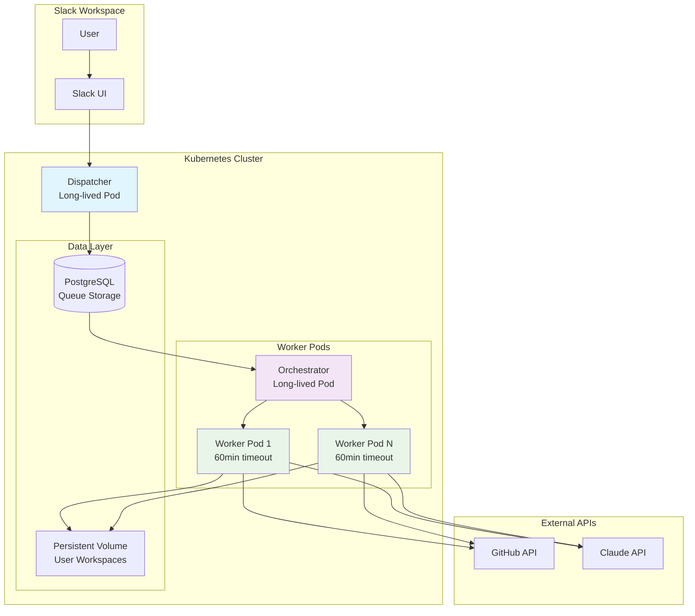

# Peerbot Architecture

## Overview

Peerbot is a Kubernetes-native Slack bot that provides AI-powered coding assistance. It uses a scalable dispatcher-orchestrator-worker pattern with persistent storage for conversation continuity.

## Core Modules

### 🚀 Dispatcher ([`packages/dispatcher/`](packages/dispatcher/))
**Responsibilities**: Slack integration, session management, job queuing
- **Socker listener**: [`src/index.ts`](packages/dispatcher/src/index.ts) - Main Slack app server that connects to Slack via Socket Mode
- **Event Handling**: [`src/slack/event-handlers.ts`](packages/dispatcher/src/slack/event-handlers.ts) - Processes Slack messages/interactions and handles Markdown conversions 
- **Repository Management**: [`src/github/repository-manager.ts`](packages/dispatcher/src/github/repository-manager.ts) - GitHub repository operations

### ⚡ Orchestrator ([`packages/orchestrator/`](packages/orchestrator/))
**Responsibilities**: Queue processing, Kubernetes worker lifecycle, deployment cleanup
- **Main Service**: [`src/index.ts`](packages/orchestrator/src/index.ts) - Queue consumer and service coordinator
- **Deployment Manager**: [`src/deployment-manager.ts`](packages/orchestrator/src/deployment-manager.ts) - Kubernetes deployment operations
- **Queue Consumer**: [`src/queue-consumer.ts`](packages/orchestrator/src/queue-consumer.ts) - PostgreSQL/pgboss job processing

### 🔧 Worker ([`packages/worker/`](packages/worker/))
**Responsibilities**: Claude CLI execution, GitHub integration, progress streaming, background process management
- **Claude Integration**: [`src/claude-worker.ts`](packages/worker/src/claude-worker.ts) - Claude CLI execution and streaming
- **Queue Integration**: [`src/queue-integration.ts`](packages/worker/src/queue-integration.ts) - Job processing and status updates
- **Background Process Management**: [`scripts/process-manager.sh`](packages/worker/scripts/process-manager.sh) - Persistent process lifecycle management

## Queue System

### Database Structure
- **Instance**: Single PostgreSQL StatefulSet (8Gi storage)
- **Queue Library**: pgboss for reliable job queuing
- **RLS**: Row Level Security to prevent cross-deployment access with separate user credentials in Postgresql.

### Queues
1. **`thread_response`**: User messages in Slack threads/channels
2. **`direct_message`**: Direct messages to the bot
3. For each worker deployment **`thread_message_{deploymentId}`**: Each conversation thread gets its own isolated queue, combined with RLS policies to prevent cross-thread access

## User Message Flow



## Architecture Diagram



## Session Persistence

### How Conversations Continue
1. **Persistent Volume**: Single 10GB PVC shared across all workers
2. **User Isolation**: Each user gets `/workspace/user-{username}/` directory
3. **Claude Sessions**: All conversation history stored in `.claude/` subdirectory
4. **Auto-Resume**: Workers use `claude --resume <session-id>` to continue conversations
5. **No Data Loss**: Data persists even when worker pods terminate

### Background Process Management
Workers include a background process management system that ensures long-running processes persist beyond worker lifecycle:

2. **Process Persistence**: Background processes (web servers, tunnels) continue running even after worker pods terminate
3. **Output Redirection**: All stdout/stderr from background processes captured in persistent logs
5. **Process Control**: `claude-processes` command provides complete lifecycle management:
   ```bash
   # Start processes with proper daemonization
   claude-processes start web-server "bun run dev" "Development web server"
   claude-processes start tunnel "cloudflared tunnel --url http://localhost:3000" "Cloudflare tunnel"
   
   # Monitor and control processes
   claude-processes status        # Check all process status
   claude-processes logs tunnel   # View process logs
   claude-processes restart web-server  # Restart failed processes
   ```

### Directory Structure
```
/workspace/                     # PVC mount point  
├── user-john/                  # Per-user workspace
│   ├── .git/                   # User's repository
│   ├── .claude/                # Claude session data (persistent)
│   │   ├── projects/           # Project context
│   │   └── sessions/           # Conversation history
│   └── [project files]         # User's code
├── user-jane/                  # Another user's workspace
│   ├── .git/
│   ├── .claude/
│   └── [project files]
└── /tmp/                       # Background process management
    ├── claude-processes/       # Process control files (.pid, .info)
    └── claude-logs/           # Process output logs
```

## Deployment Management

### Worker Lifecycle
- **Creation**: Orchestrator creates Kubernetes deployment per conversation thread
- **Scaling**: Deployments start with 1 replica, scale to 0 after 60 minutes idle
- **Cleanup**: Idle worker cleanup runs every minute, removes deployments idle >60min
- **Persistence**: User data remains in PVC even after pod deletion

### Idle Worker Cleanup Process

The orchestrator automatically cleans up idle worker deployments to prevent resource accumulation:

1. **Cleanup Schedule**: Runs every minute via `setInterval`
2. **Idle Detection**: SQL query identifies deployments with no activity for >60 minutes:
   ```sql
   SELECT deployment_id, user_id, last_activity, 
          EXTRACT(EPOCH FROM (NOW() - last_activity))/60 as minutes_idle,
          COUNT(*) as message_count
   FROM pgboss.job 
   WHERE name = 'thread_response' 
     AND last_activity < NOW() - INTERVAL '60 minutes'
   GROUP BY deployment_id, user_id
   ```
3. **Resource Cleanup**: For each idle deployment, removes:
   - Kubernetes Deployment: `peerbot-worker-{deploymentId}`
   - PersistentVolumeClaim: `peerbot-workspace-{deploymentId}` (if exists)
   - Kubernetes Secret: `peerbot-user-secret-{username}`
4. **Logging**: Detailed logs show which deployments were cleaned up and why

### PostgreSQL User Management & RLS

Each worker gets isolated database access through dedicated PostgreSQL users:

#### User Creation Process
1. **Username Generation**: `slack_{workspaceId}_{userId}` (lowercase)
2. **Password**: 32-character random string (URL-safe characters)
3. **Database User**: Created with pgboss schema permissions:
   ```sql
   CREATE USER "slack_workspace_user123" WITH PASSWORD 'randompassword';
   GRANT USAGE ON SCHEMA pgboss TO "slack_workspace_user123";
   GRANT ALL ON ALL TABLES IN SCHEMA pgboss TO "slack_workspace_user123";
   ```
4. **Kubernetes Secret**: Credentials stored in `peerbot-user-secret-{username}`

#### Row Level Security (RLS)
Database queries execute with user context for access control:
```sql
-- Set user context before queries
SELECT set_config('app.current_user_id', $1, true);
-- RLS policies can now filter based on current_setting('app.current_user_id')
```

This ensures workers can only access their own thread messages and user data.

### Resource Limits
- **Dispatcher**: 1 replica, 256Mi-1Gi memory, 100m-500m CPU
- **Orchestrator**: 1 replica, 256Mi-2Gi memory, 100m-1000m CPU  
- **Workers**: 0-N replicas, 256Mi-2Gi memory, 100m-1000m CPU (auto-scaled)

## Status Indicators

| Emoji | Status | Description |
|-------|--------|-------------|
| ⚙️ | Processing | The deployment is active, processing user's request or running background processes |
| ✅ | Complete | Task completed successfully |
| ❌ | Failed | Error during execution |
| ⏳ | Timeout | Job exceeded time limit |

## Rate Limiting & Security

- **Rate Limits**: 5 jobs per user per 15 minutes
- **Pod Security**: Non-root containers, read-only filesystem except `/workspace`
- **Network**: Workers access only GitHub and Claude API
- **Secrets**: Kubernetes secrets for API tokens, mounted as volumes